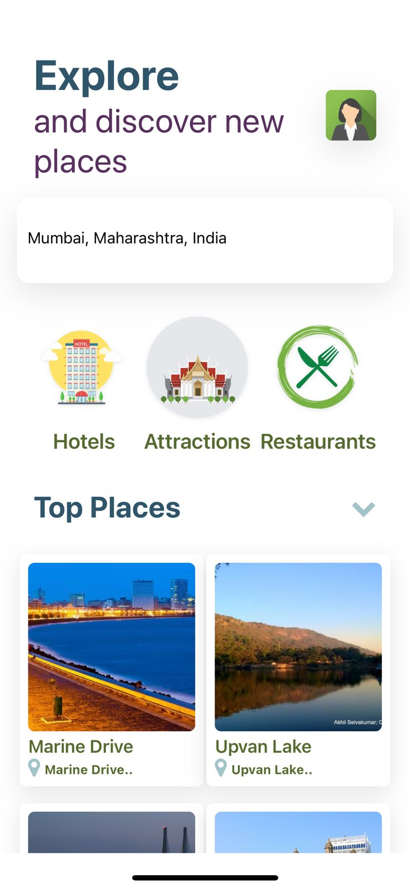

# Go Travel

## About The Project
Go Travel is a mobile application built with React Native for travelers who want to explore different destinations and get information about them.

It provides comprehensive guidance to travelers, offering a detailed and complete list of information, such as the best hangout spots and top-rated restaurants in the city. The app aims to solve common problems encountered by travelers, including selecting the right destination and finding suitable options based on specific keywords.

Go Travel utilizes real-time information to keep users up-to-date on monuments, restaurants, hotels, and places of interest in unfamiliar cities. The app's user-friendly interface makes it easy for users to navigate and find necessary information for trip planning.

  


## Built With
- React Native
- Javascript
- React Navigation
- Expo
- Axios

## Features
- Comprehensive information about destinations, including places to hang out and the best restaurants
- Solutions to common problems travelers may face, such as selecting the correct destination and finding suitable dining options
- Real-time information about monuments, restaurants, hotels, and other places of interest for travelers to explore
- User-friendly interface for easy navigation and finding information
- Search function to find information about a specific location
- User can view different destinations with images and descriptions

## Getting Started
To get a local copy up and running, follow these steps:

1. Install Expo CLI globally on your system using the following command:
   ```shell
   npm install -g expo-cli
2. Navigate to the project directory:
   ```shell
   cd travel-advisor
3. Install the project dependencies:
   ```shell
   npm install
4. Start the Expo development server (This will launch the Expo developer tools in your browser. From there, you can either use an Android or iOS emulator or scan the QR code using the Expo app on your mobile device to launch the app.):
   ```shell
   npx expo start  
